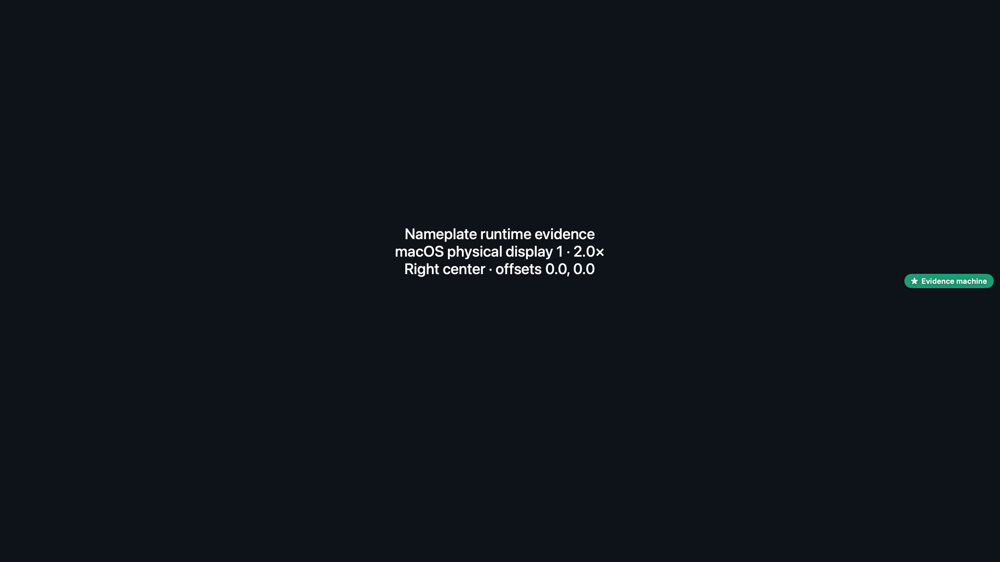
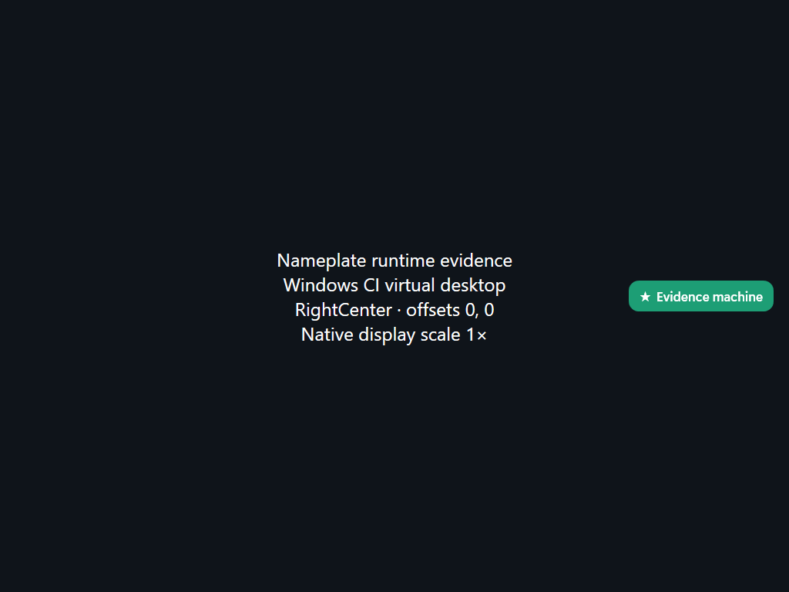

# Nameplate PR #36 runtime evidence

Real native runtime captures with a synthetic “Evidence machine” identity. All eight anchors plus signed offsets and extreme-offset clamping passed checks against photographed tag pixels. Each runtime.json records the production source revision, dimensions, scale, offsets, and observed bounds.

**Physical multi-monitor, display reconnect/rearrangement, mixed-scale, and notch hardware checks are still pending.** Virtual desktops do not establish those behaviors.

Reproduction tools: [Scripts/evidence](https://github.com/Czaruno/Nameplate/tree/codex/edge-center-positions/Scripts/evidence). No screenshots are added to the feature PR diff.

## macos

Physical macOS display, 1600×900 points, 3200×1800 pixels, 2× scale. ScreenCaptureKit captures a live composite of the production NSPanel/SwiftUI overlay and a synthetic backdrop only.

Production revision: `54eb0a362ec212b6b1f3a676e9ac352dd3e1343d`. [Measurements](./macos/runtime.json).

- [topLeft-0-0-display-1.png](./macos/topLeft-0-0-display-1.png)
- [topCenter-0-0-display-1.png](./macos/topCenter-0-0-display-1.png)
- [topRight-0-0-display-1.png](./macos/topRight-0-0-display-1.png)
- [leftCenter-0-0-display-1.png](./macos/leftCenter-0-0-display-1.png)
- [rightCenter-0-0-display-1.png](./macos/rightCenter-0-0-display-1.png)
- [bottomLeft-0-0-display-1.png](./macos/bottomLeft-0-0-display-1.png)
- [bottomCenter-0-0-display-1.png](./macos/bottomCenter-0-0-display-1.png)
- [bottomRight-0-0-display-1.png](./macos/bottomRight-0-0-display-1.png)
- [rightCenter-0--100-display-1.png](./macos/rightCenter-0--100-display-1.png)
- [rightCenter-0-100-display-1.png](./macos/rightCenter-0-100-display-1.png)
- [topCenter--100-0-display-1.png](./macos/topCenter--100-0-display-1.png)
- [bottomRight-100000-100000-display-1.png](./macos/bottomRight-100000-100000-display-1.png)

## windows

GitHub-hosted Windows VM, native production WPF TagWindow, one virtual 1024×768 display at 1×. Captures downloaded from upstream CI run 36806735323.

Production revision: `1fa36ffb7ffd33621e68e61c20ed07af818402e3`. [Measurements](./windows/runtime.json).

- [TopLeft-0-0.png](./windows/TopLeft-0-0.png)
- [TopRight-0-0.png](./windows/TopRight-0-0.png)
- [BottomLeft-0-0.png](./windows/BottomLeft-0-0.png)
- [BottomRight-0-0.png](./windows/BottomRight-0-0.png)
- [TopCenter-0-0.png](./windows/TopCenter-0-0.png)
- [LeftCenter-0-0.png](./windows/LeftCenter-0-0.png)
- [RightCenter-0-0.png](./windows/RightCenter-0-0.png)
- [BottomCenter-0-0.png](./windows/BottomCenter-0-0.png)
- [RightCenter-0--100.png](./windows/RightCenter-0--100.png)
- [RightCenter-0-100.png](./windows/RightCenter-0-100.png)
- [TopCenter--100-0.png](./windows/TopCenter--100-0.png)
- [BottomRight-100000-100000.png](./windows/BottomRight-100000-100000.png)

## linux

Production GTK daemon running on Linux arm64 in a Debian Docker container, Xvfb/Openbox/xcompmgr X11 desktop, one virtual 1280×800 display at 1×. Captures use the compositor corrections committed in ea980c0.

Production revision: `54eb0a362ec212b6b1f3a676e9ac352dd3e1343d`. [Measurements](./linux/runtime.json).

- [topLeft-0-0.png](./linux/topLeft-0-0.png)
- [topCenter-0-0.png](./linux/topCenter-0-0.png)
- [topRight-0-0.png](./linux/topRight-0-0.png)
- [leftCenter-0-0.png](./linux/leftCenter-0-0.png)
- [rightCenter-0-0.png](./linux/rightCenter-0-0.png)
- [bottomLeft-0-0.png](./linux/bottomLeft-0-0.png)
- [bottomCenter-0-0.png](./linux/bottomCenter-0-0.png)
- [bottomRight-0-0.png](./linux/bottomRight-0-0.png)
- [rightCenter-0--100.png](./linux/rightCenter-0--100.png)
- [rightCenter-0-100.png](./linux/rightCenter-0-100.png)
- [topCenter--100-0.png](./linux/topCenter--100-0.png)
- [bottomRight-100000-100000.png](./linux/bottomRight-100000-100000.png)

